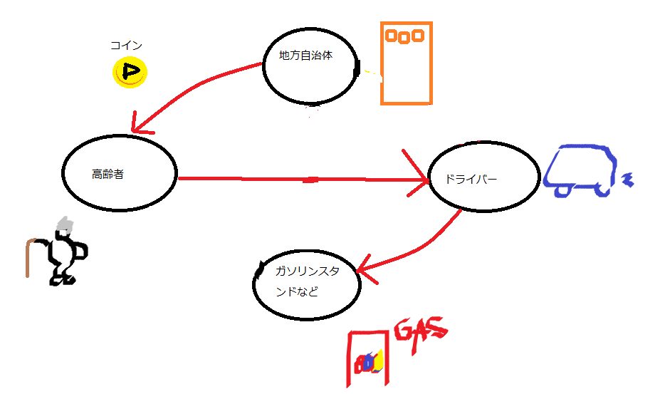

# 仮想通貨の仕組み
## コインの流れ
---

 
まず、私たちが仮想通貨として利用するコインの名前を *ピックアップ* と呼ぶことにします。
 
*ピックアップ* は地方自治体で発行され、それらは、**運転免許を返納したお年寄り** や、**各駅、各バス停からある一定距離ある人** が受け取ることができます。
 
そこで送迎をしてほしい人の元に、地方自治体から連絡を受け取ったドライバーが来てくれて、**いきたいところか、その近くまで** 送り届けてくれます。
 
ドライバーは、**どこかに行くついでに乗せる**、**家への帰り道に乗せる**というようにドライバーへの負担も少ないです。
 
送迎したもらった人、利用者は、距離に応じたコインをドライバーへ渡します。
 
ドライバーは *ピックアップ* を使って、**ガソリン代の割引**、**車の維持費**への還元に使えます。
 
ガソリンスタンドはコインを使えるスタンドとして、客足も増え、**売り上げアップ** にもつながります。
 
*ピックアップ* には従来のタクシー、バスにはない便利さを兼ね備えています。時間、体力、お金をすべて解決したコインとなっています。
 
もちろんバス、タクシー会社との連携も欠かせません。ドライバーとの都合が合わなかったとき、**すぐにタクシーが駆け付けます**。
 
また **人が多い時間帯をリアルタイムで確認できることができ**、**バスの時間をベストなタイミングで走らせる** ということができるようになります。
 
生活をより良いものに、**LET'S PICKUP!**
