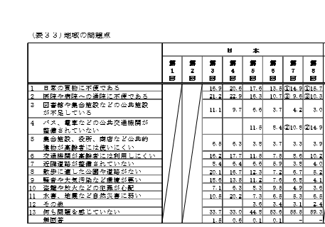

# どのような人が利用するのか

#### 近くのスーパーに行くのも大変な高齢者
  

データとして、[1]内閣府の高齢者の生活と意識　第8回国際調査比較より高齢者が抱える地域の具体的な問題として最も高かったのは
##### 「日常の買い物に不便」
であった。 また、「公共交通機関の整備がされていない」が次に高くなっている。

### 以上より、送迎は高齢者の必要としているものであるといえる

引用
[1] http://www8.cao.go.jp/kourei/ishiki/h27/gaiyo/index.html

[前のページへ](https://16-2505-002-9.github.io/pickup/1)
[次のページへ](https://16-2505-002-9.github.io/pickup/four)
